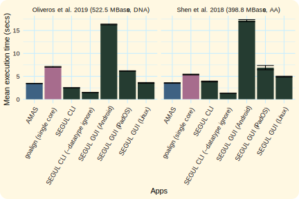

For general users, SEGUL is available in two versions: **Command Line Interface** (CLI) and **Graphical User Interface** (GUI). Both versions have the same core functionality, but they are designed to cater to different use cases and user preferences.

Summary of the CLI version advantages:

- Faster and more memory efficient
- Supports non-GUI platforms, such as HPC clusters.
- Supports non-standard file extensions
- Supports complex directory structure
- Supports filter out alignment with multiple percentage values
- Supports `--dry-run` option for some commands
- Supports all major desktop platforms and Windows Subsystem for Linux (WSL)
- The ability to compile from the source code for any platform that supports Rust

Summary of the GUI version advantages:

- Interactive and user-friendly
- Supports text and table viewer without third-party software
- Supports mobile platforms
- Easier to use for users who are not familiar with the command line
- Available for all major desktop and mobile platforms, but is limited by the Flutter framework platform support

:::note
You can install both GUI and CLI versions in the system that supports them. Each version operate in its own contained environment and does not interfere with the other.
:::

## Platform Support

The GUI version is available for all major desktop and mobile platforms. The CLI version is available for all major desktop platforms and Windows Subsystem for Linux (WSL). Here is a summary of the platform support for both versions:

### Desktop

| Platform                          | GUI | CLI |
| --------------------------------- | --- | --- |
| Linux*                            | ✅   | ✅   |
| MacOS                             | ✅   | ✅   |
| Windows*                          | ✅   | ✅   |
| Windows Subsystem for Linux (WSL) | ❌   | ✅   |

:::note
 The GUI version on **Linux** required GLIBC 2.34+. The CLI works in any Linux distribution. We provide fully static binary for older Linux and dynamically linked binary to GLIBC for newer distributions. See [GUI](./installation/install_gui) and [CLI](./installation/install_binary) installation instruction for more details.

 You can also compile the CLI version from the source code for any platform that supports Rust. See [installation from source code](./installation/install_source) for more details.
:::

:::info
The CLI binary since version 0.21.3 is also available for ARM64 architecture on Linux.
:::

### Mobile

| Platform | GUI | CLI |
| -------- | --- | --- |
| iOS      | ✅   | ❌   |
| iPadOS   | ✅   | ❌   |
| Android  | ✅   | ❌   |

:::note
The CLI version works on Android using [Termux](https://termux.dev/). However, we recommend using the GUI version for better access to file system.
:::

## Features comparison

All the main features are supported in both CLI and GUI. However, there are some differences between the two versions. Here is a summary of the differences:

| Feature                                              | CLI | GUI |
| ---------------------------------------------------- | --- | --- |
| Text and table viewer                                | ❌   | ✅   |
| Mobile OS support                                    | ❌   | ✅   |
| `--dry-run` option for some commands                 | ✅   | ❌   |
| Filter out alignment with multiple percentage values | ✅   | ❌   |
| Handling complex directory structure                 | ✅   | ❌   |
| Non-standard file extensions                         | ✅   | ❌   |

## Task Group

The GUI and CLI version of SEGUL have the similar task group. The task group is equal to command, whereas the task is equal to subcommand in the CLI version. The name of the task group for CLI version is the same as the GUI version, except for **genomic summary statistics** and **partition conversion**. The genomic summary statistics is split into two separate subcommands each for sequence reads and contigs. The partition conversion is available in the partition subcommand.

Learn more about [CLI](./cli-usage/command_options) and [GUI](./gui-usage/general) options.

## Performance and Memory Efficiency

Generally, the CLI version outperforms the GUI version in terms of speed and memory efficiency. The CLI version is exclusively developed in [Rust](https://www.rust-lang.org/), a high-performance programming language. On the other hand, while the core functionality of the GUI version utilizes the same code as the CLI version, the GUI code is written in [Dart](https://dart.dev/). Despite this difference, the GUI version maintains similar speed and memory efficiency for the majority of use cases on identical hardware (see below).

:::warning
For the GUI version on mobile devices, accessing the input file requires caching the file in the app’s designated temporary directory. This process may be more time-consuming and handling large number files may not be feasible. In our test on iOS, we could input up to 1,500 UCE loci on an iPhone 14. On Android, we could input over 4,000 of the UCE loci on a Xiaomi Redmi Note 12 by inputting the file in batches, with a maximum of 1,500 loci per batch. We are working on supporting compressed file input to improve the performance of the GUI version on mobile devices.
:::

## Performance Comparison

Below is performance comparison for **alignment concatenation**  across different platforms. We tested SEGUL CLI and GUI on Linux using identical hardware. We also include [AMAS](https://github.com/marekborowiec/AMAS) and [goalign](https://github.com/evolbioinfo/goalign) to provide additional context about the performance of SEGUL. Take a look at SEGUL [publication](https://doi.org/10.1111/1755-0998.13964) to learn about testing methodology and to see more benchmarks.

### Execution time comparison

### RAM usage comparison

:::note
The RAM usage comparison is only available for the desktop versions of SEGUL.
:::
